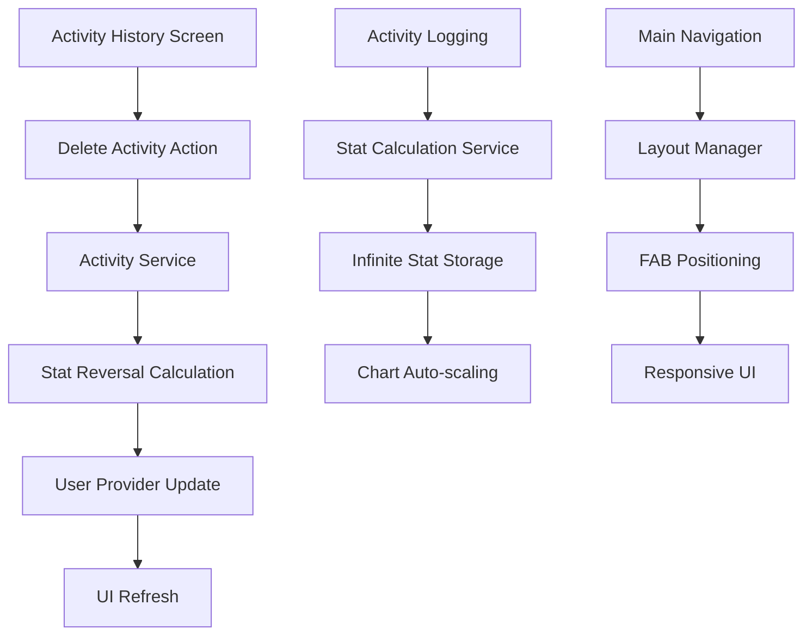

# Design Document

## Overview

This design addresses three critical improvements to the YoloLeveling app: implementing proper stat reversal when activities are deleted, removing stat ceilings for infinite progression, and fixing UI overlap issues. The design maintains backward compatibility while enhancing the user experience and ensuring data integrity.

## Architecture

### Component Interaction Flow



### Data Flow Architecture

The improvements will integrate with the existing Provider pattern and service layer:

1. **Activity Deletion Flow**: History Screen → Activity Service → Stats Service → User Provider → UI Update
2. **Infinite Stats Flow**: Activity Logging → Stats Calculation → Storage → Chart Rendering
3. **UI Layout Flow**: Navigation Controller → Layout Calculator → Component Positioning

## Components and Interfaces

### 1. Enhanced Activity Service

```dart
class ActivityService {
  // New method for activity deletion with stat reversal
  Future<void> deleteActivityWithStatReversal(ActivityLog activity) async {
    // Calculate stat reversals
    Map<StatType, double> statReversals = _calculateStatReversals(activity);
    
    // Apply reversals to user stats
    await _applyStatReversals(statReversals);
    
    // Handle EXP reversal and potential level-down
    await _handleEXPReversal(activity.expGained);
    
    // Delete the activity record
    await _activityRepository.deleteActivity(activity.id);
  }
  
  Map<StatType, double> _calculateStatReversals(ActivityLog activity) {
    // Use existing stat calculation logic in reverse
    // Apply same rates that were used during original logging
  }
  
  Future<void> _handleEXPReversal(int expToReverse) async {
    // Handle level-down scenarios
    // Recalculate level based on remaining EXP
  }
}
```

### 2. Infinite Stats System

```dart
class StatsService {
  // Remove ceiling constraints
  Map<StatType, double> calculateStatGains(ActivityType activity, int durationMinutes) {
    // Existing calculation logic without ceiling checks
    // Allow stats to grow beyond 5.0
    return gains;
  }
  
  // Enhanced validation with only floor constraint
  double validateStatValue(double value) {
    return math.max(1.0, value); // Only floor constraint, no ceiling
  }
}
```

### 3. Enhanced Chart Component

```dart
class StatsOverviewChart extends StatelessWidget {
  Widget build(BuildContext context) {
    return Consumer<UserProvider>(
      builder: (context, userProvider, child) {
        // Auto-scale chart based on maximum stat value
        double maxStat = _calculateMaxStat(userProvider.user.stats);
        double chartMax = _calculateChartMax(maxStat);
        
        return BarChart(
          BarChartData(
            maxY: chartMax, // Dynamic scaling
            // ... rest of chart configuration
          ),
        );
      },
    );
  }
  
  double _calculateChartMax(double maxStat) {
    // Calculate appropriate chart maximum
    // Round up to next meaningful increment
    if (maxStat <= 5) return 5;
    if (maxStat <= 10) return 10;
    return ((maxStat / 5).ceil() * 5).toDouble();
  }
}
```

### 4. Layout Management System

```dart
class MainNavigationScreen extends StatelessWidget {
  Widget build(BuildContext context) {
    return Scaffold(
      body: _buildTabContent(),
      bottomNavigationBar: _buildBottomNavigation(),
      floatingActionButton: _buildFloatingActionButton(),
      floatingActionButtonLocation: FloatingActionButtonLocation.centerDocked,
    );
  }
  
  Widget _buildFloatingActionButton() {
    return Container(
      margin: EdgeInsets.only(
        bottom: MediaQuery.of(context).padding.bottom + 16, // Safe area + margin
      ),
      child: FloatingActionButton(
        // FAB implementation
      ),
    );
  }
}
```

## Data Models

### Enhanced Activity Log Model

```dart
@HiveType(typeId: 1)
class ActivityLog extends HiveObject {
  @HiveField(0)
  String id;
  
  @HiveField(1)
  ActivityType type;
  
  @HiveField(2)
  int durationMinutes;
  
  @HiveField(3)
  DateTime timestamp;
  
  @HiveField(4)
  int expGained;
  
  @HiveField(5)
  Map<StatType, double> statsGained; // Store exact gains for reversal
  
  // Constructor and methods
}
```

### User Model Updates

```dart
@HiveType(typeId: 0)
class User extends HiveObject {
  @HiveField(0)
  int level;
  
  @HiveField(1)
  int exp;
  
  @HiveField(2)
  Map<StatType, double> stats; // No ceiling constraints in validation
  
  // Remove any ceiling validation methods
  // Keep only floor validation (minimum 1.0)
}
```

## Error Handling

### Activity Deletion Error Scenarios

1. **Stat Floor Violation**: If reversal would push stats below 1.0, clamp to 1.0
2. **Level-Down Calculation**: Handle edge cases where EXP reversal affects multiple levels
3. **Data Consistency**: Ensure atomic operations for stat/EXP reversals
4. **UI State Management**: Handle loading states during deletion operations

### Infinite Stats Error Scenarios

1. **Chart Rendering**: Handle very large stat values gracefully
2. **Display Precision**: Limit decimal places for readability while maintaining accuracy
3. **Performance**: Ensure chart auto-scaling doesn't impact performance
4. **Data Export**: Handle large stat values in JSON export/import

### UI Layout Error Scenarios

1. **Screen Size Variations**: Test on various device sizes and orientations
2. **Accessibility**: Ensure proper spacing with accessibility features enabled
3. **Navigation State**: Handle FAB positioning during navigation transitions
4. **Keyboard Visibility**: Adjust FAB position when keyboard is shown

## Testing Strategy

### Unit Tests

1. **Stat Reversal Logic**
   - Test exact reversal calculations for each activity type
   - Test level-down scenarios with various EXP amounts
   - Test stat floor constraints during reversal

2. **Infinite Stats System**
   - Test stat calculations beyond ceiling values
   - Test chart scaling algorithms
   - Test data persistence for large stat values

3. **UI Layout Calculations**
   - Test FAB positioning algorithms
   - Test responsive layout calculations
   - Test safe area handling

### Integration Tests

1. **Complete Deletion Flow**
   - Test activity deletion from history screen
   - Verify stat and EXP reversals are applied correctly
   - Confirm UI updates reflect changes immediately

2. **Infinite Progression Flow**
   - Test continuous stat growth beyond 5.0
   - Verify chart auto-scaling works correctly
   - Test backup/restore with high stat values

3. **UI Layout Flow**
   - Test FAB positioning across different screens
   - Verify no overlaps on various device sizes
   - Test accessibility compliance

### Widget Tests

1. **Enhanced History Screen**
   - Test delete confirmation dialogs
   - Test loading states during deletion
   - Test error handling display

2. **Auto-scaling Charts**
   - Test chart rendering with various stat ranges
   - Test chart responsiveness and performance
   - Test chart accessibility features

3. **Layout Components**
   - Test FAB positioning in different scenarios
   - Test navigation bar interactions
   - Test responsive behavior

## Performance Considerations

### Activity Deletion Performance

- Implement efficient stat reversal calculations
- Use batch operations for multiple stat updates
- Minimize UI rebuilds during deletion process

### Chart Auto-scaling Performance

- Cache chart scaling calculations
- Implement efficient chart data preparation
- Use appropriate chart update strategies

### UI Layout Performance

- Optimize layout calculations for FAB positioning
- Minimize layout rebuilds during navigation
- Use efficient responsive design patterns

## Backward Compatibility

### Data Migration

- Existing activity logs without `statsGained` field will use calculated values
- Existing users with stats at 5.0 ceiling can immediately progress beyond
- No breaking changes to existing data structures

### UI Compatibility

- Layout changes maintain existing navigation patterns
- Chart enhancements are backward compatible
- No changes to existing user workflows

## Security Considerations

### Data Integrity

- Validate stat reversal calculations to prevent manipulation
- Ensure atomic operations for activity deletion
- Maintain data consistency during level-down scenarios

### Input Validation

- Validate activity deletion requests
- Sanitize stat values during calculations
- Prevent invalid state transitions

## Deployment Strategy

### Phased Rollout

1. **Phase 1**: Implement infinite stats system (low risk)
2. **Phase 2**: Add UI layout fixes (medium risk)
3. **Phase 3**: Implement activity deletion with stat reversal (high complexity)

### Testing Approach

- Comprehensive unit testing before integration
- User acceptance testing for UI improvements
- Performance testing with large datasets

### Rollback Plan

- Maintain backward compatibility for easy rollback
- Implement feature flags for gradual rollout
- Monitor performance metrics post-deployment